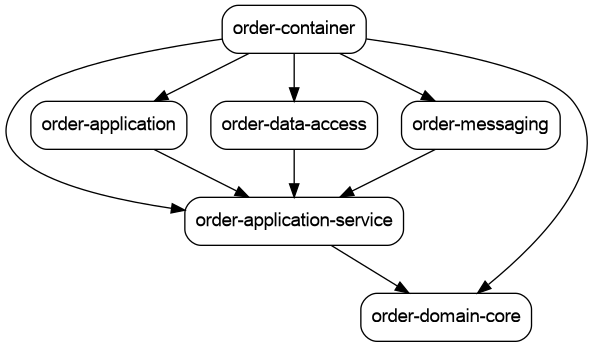

project based on course: https://www.udemy.com/course/microservices-clean-architecture-ddd-saga-outbox-kafka-kubernetes/

## Project structure:
To generate the structure of the project, I used the following command:
```
mvn com.github.ferstl:depgraph-maven-plugin:aggregate -DcreateImage=true -DreduceEdges=false -Dscope=compile "-Dincludes=com.andrei.food.ordering.system*:*"
```


## Running kafka using docker
Run this commands in sequence:
```
 docker compose -f common.yml -f postgresql.yml up
 docker-compose -f common.yml -f zookeeper.yml up
 docker-compose -f common.yml -f kafka_cluster.yml up
 docker-compose -f common.yml -f init_kafka.yml up
```

## Running the project
First Start Customer Service, then Order Service, then Payment Service and finally the Restaurant Service.
then import the postman collection, run the create customer request, then the create_order_success.
To check if everything is working, run the get_order_by_orderTrackingId passing the orderTrackingId from the create_order_success response
orderStatus should transition from PENDING to APPROVED to PAID.

Check the outbox tables in the order schema (payment_outbox and restaurant_approval_outbox) to see the events being published to the kafka topic.
Check the outbox table in the payment schema (order_outbox) to see the events being consumed from the kafka topic.
Check the outbox table in the restaurant schema (order_outbox) to see the events being consumed from the kafka topic.
